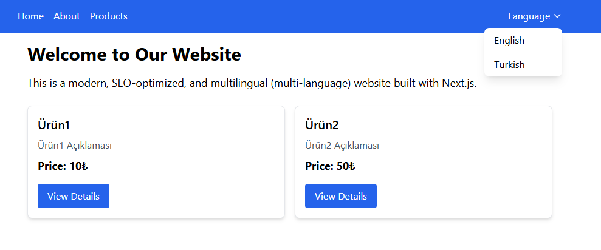

# Next.js SEO & JSON-LD Multilingual i18n Frontend



This project is a frontend application built with Next.js that supports multilingual (i18n), SEO optimization, and JSON-LD structured data. It is developed using modern technologies including TypeScript, Tailwind CSS, and ESLint.

---

## Technologies and Libraries

- **Next.js** v15.3.2 — React-based SSR & SSG framework
- **React** v19 — UI library
- **next-i18next** v15.4.2 — Multilingual support (i18n)
- **next-seo** v6.8.0 — SEO meta tags and JSON-LD management
- **Tailwind CSS** v3.4.0 — Utility-first CSS framework
- **TypeScript** v5 — Type safety
- **ESLint + Prettier** — Code quality and formatting
- **PostCSS + Autoprefixer** — CSS preprocessing

---

## Installation

1. Clone the repository or download it:

```bash
git clone https://github.com/username/project-name.git
cd project-name
```

2. Install dependencies:

```bash
npm install
```

3. Development Server

```bash
   npm run dev
```

This will start a local development server, usually available at http://localhost:3000.

4. Production Build and Start

```bash
npm run build
npm start
```

5. Linting
   To check and fix code quality, run:

```bash
npm run lint
```

## Project Features

Multilingual support: Localization with next-i18next

SEO and JSON-LD: Page-level SEO meta tags and structured data using next-seo

Styling with Tailwind CSS: Fast and customizable UI styling

TypeScript: Enhanced type safety and error reduction

ESLint & Prettier: Maintain coding standards and consistent formatting

## Project Structure

```bash

public/         # Static files (images, favicon, etc.)
  locales/      # Language JSON files for i18n
src/
  components/   # Reusable UI components
  data/         # data with static
  pages/        # Next.js page components
  styles/       # CSS and Tailwind configuration files
  types/        # stores TypeScript types for type safety.
```

Contact & Contribution
For suggestions, bug reports, or contributions, please open an issue at GitHub Issues.

Note: This project uses Next.js version 15.3.2. Please verify compatibility with newer versions if upgrading.

If you want, I can help you tailor the README with more project-specific details or add usage examples!
